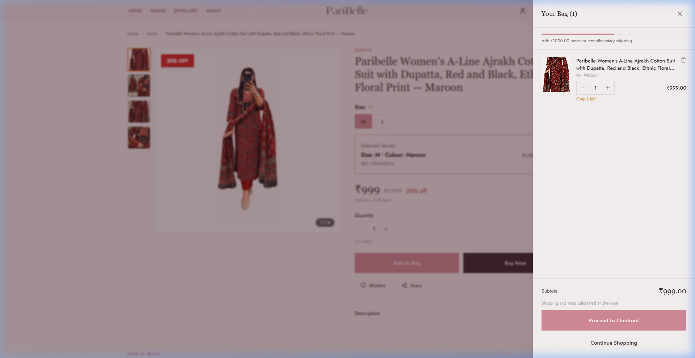
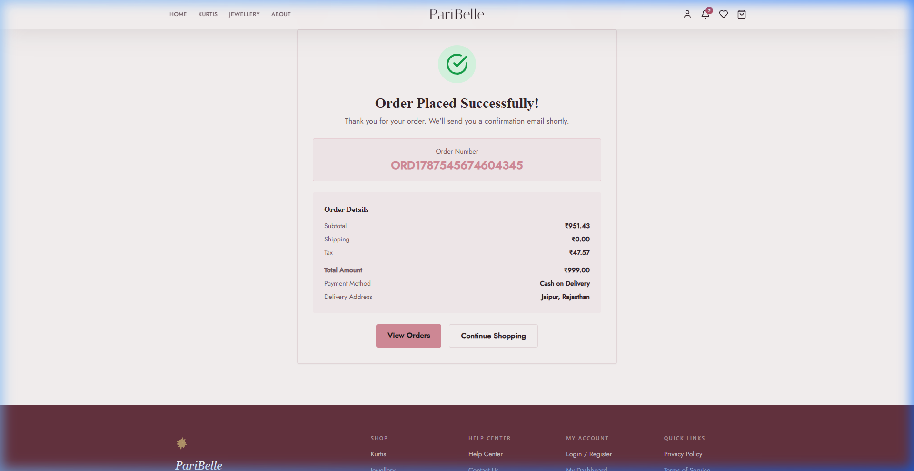
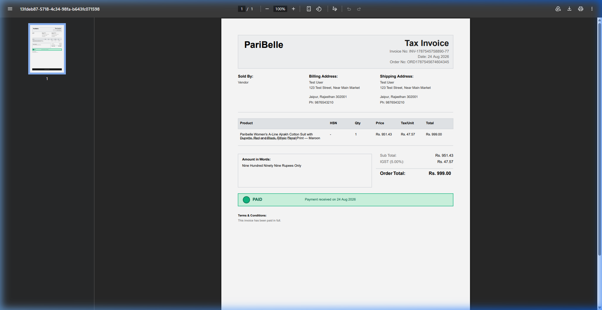
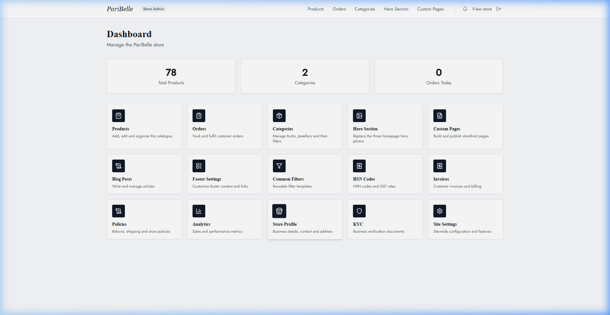
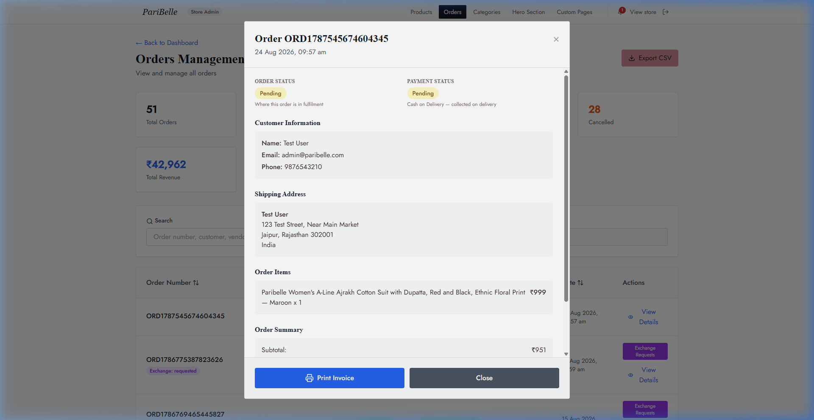

<div align="center">

# 🌸 PariBelle

**Premium Designer Kurtis & Artificial Jewellery — E-Commerce Platform**

[](https://nextjs.org/)
[](https://nestjs.com/)
[](https://www.postgresql.org/)
[](https://tailwindcss.com/)
[](https://razorpay.com/)
[](https://cloudinary.com/)

**Live Storefront:** [https://www.paribelle.in](https://www.paribelle.in) &nbsp;|&nbsp; **Live API:** [https://paribelle-backend.onrender.com](https://paribelle-backend.onrender.com/api/docs) &nbsp;|&nbsp; **Admin:** [https://www.paribelle.in/admin](https://www.paribelle.in/admin)

</div>

---

## 📸 Visual Showcase

<div align="center">

### 🛍️ Storefront & Customer Shopping Experience
| High-Converting Homepage | Interactive Bag & Cart Drawer |
| :---: | :---: |
|  |  |

| Instant Order Confirmation | GST-Compliant Tax Invoice |
| :---: | :---: |
|  |  |

### 🛠️ Unified Admin Control Center
| Real-Time Commerce Analytics & KPIs | End-to-End Order & Payment Management |
| :---: | :---: |
|  |  |

</div>

---

## 🧪 Production Testing & Quality Assurance Suite

We maintain a rigorous 5-phase end-to-end testing suite against the live production environment (`paribelle.in` & `paribelle-backend.onrender.com`):

| Phase | Scope & Scenarios | Status | Details |
|---|---|:---:|---|
| **Phase 1** | **Storefront, Visuals, Currency & Browsing** | ✅ **PASSED** | Visual audits, currency formatting strictly in ₹, category hierarchy, typeahead search, zero broken images, and footer copyright verification. |
| **Phase 2** | **Authentication, Security & Sessions** | ✅ **PASSED** | Customer registration (`/signup`), error handling for invalid credentials, forgot password requests, admin authentication, session persistence across refresh, secure logout, and storage audits (no plaintext passwords in `localStorage`). |
| **Phase 3** | **Cart, Checkout, Stock Limits & Payment Edge Cases** | ✅ **PASSED** | Variant-level stock validation (eliminated `\|\| 999` bug), cart persistence in `localStorage`, empty cart checkout blocking, backend negative quantity rejection (`HTTP 400`), synchronous double-submission prevention locks, and Razorpay modal dismissal / order release handling. |
| **Phase 4** | **Admin Operations & Exchange/Returns Lifecycle** | ⏳ **SCHEDULED** | Category CRUD, product variant updates, order status transitions (`pending` → `confirmed` → `shipped` → `delivered`), invoice auto-generation, exchange request → admin approval → courier dispatch → quality check → replacement / store credit ledger. *(To be executed in next test run)*. |
| **Phase 5** | **Performance, Mobile Responsiveness & Multi-Device QA** | ⏳ **SCHEDULED** | Viewport responsiveness (375px mobile breakpoint), hamburger navigation, drawer behavior, API rate-limiting thresholds (100 req/min), and Cloudinary asset delivery audits. *(To be executed in next test run)*. |

---

## 🏛️ System Architecture

PariBelle is structured as a high-performance monorepo-style workspace containing two synchronized applications:

```
f:\paribelle\
├── marketplace-web/          # Next.js 14 App Router (Deployed on Vercel)
│   ├── src/app/(storefront)  # Customer discovery, catalog, bag, checkout, orders, wallet
│   ├── src/app/admin         # Unified store admin (Orders, Products, KYC, Invoices, Settings)
│   ├── src/components        # Handcrafted UI kit, modals, drawers, product galleries
│   └── src/contexts          # Zustand & Context state (Cart, Notifications, Stock WebSockets)
│
├── marketplace-backend/      # NestJS 10 REST API (Deployed on Render)
│   ├── src/modules/          # Auth, Orders, Payments, Invoices, Products, Wallet, Stock
│   ├── src/migrations/       # TypeORM database schema versioning
│   └── src/common/           # Cloudinary, security guards, interceptors, rate limiting
│
├── docs/assets/              # Architecture diagrams, visual snapshots, and assets
└── docker-compose.yml        # Local PostgreSQL 16 & API containerization
```

---

## 🚀 Quick Start (Local Development)

### 1. Prerequisites
- **Node.js 18+** & npm
- **Docker Desktop** (for PostgreSQL)

### 2. Environment Setup
```bash
# Clone and copy environment variables
cp .env.example .env
```

### 3. Initialize Database (First Time Only)
> ⚠️ **Notice**: The init profile drops and recreates tables with default seed data. Run only on fresh setups.
```bash
docker compose --profile init run --rm init
```

### 4. Start Backend Services
```bash
docker compose up -d
```
- **API Server**: `http://localhost:3001`
- **Swagger Docs**: `http://localhost:3001/api/docs`

### 5. Start Storefront & Admin
```bash
cd marketplace-web
npm install
npm run dev
```
- **Storefront**: `http://localhost:3000`
- **Admin Panel**: `http://localhost:3000/admin`
- **Seeded Admin Credentials**: `admin@paribelle.com` / `Admin@123`

---

## 💎 Core Capabilities & Single-Store Rules

1. **Single-Store Consolidation**:
   - The platform models products under a dedicated root vendor UUID (`NEXT_PUBLIC_STORE_VENDOR_ID`).
   - Platform commission defaults strictly to `0%`.
   - `/vendor/*` automatically redirects to the unified `/admin` dashboard.
2. **Indian GST & HSN Invoicing**:
   - Automatic calculation of intra-state (`CGST` + `SGST`) vs inter-state (`IGST`) tax based on shipping destination.
   - Dynamic HSN code lookup and automatic PDF invoice generation with amount in words.
3. **Atomic Stock & Concurrency**:
   - Transactional conditional updates prevent race-condition overselling.
   - Variant-level stock binding (Size / Color) guarantees accurate inventory counts.
4. **Resilient Payment Integration**:
   - Razorpay test & production webhook signature verification.
   - Idempotency key tracking prevents accidental double-click order creation.
   - Strict money status tracking: `refund_pending` → `refunded` via signed gateway callbacks.
5. **In-App Realtime Communication**:
   - Socket.IO gateway delivers instant order lifecycle notifications to the user notification bell.
   - Zero email spam for order transitions — transactional email is reserved strictly for authentication & verification.

---

## ⚡ High-Priority Database Roadmap: Shifting to Neon

> [!IMPORTANT]
> **Render Free PostgreSQL Limitation**: Render's free PostgreSQL instances are automatically deleted after 30 days. To safeguard customer orders, catalogues, and payment histories, migrate production database hosting to **Neon Serverless Postgres**.

### 📋 Neon Migration Plan
- [ ] **Step 1 — Provision Neon Database**: Create a Neon project with pooling enabled (`pgbouncer`).
- [ ] **Step 2 — Environment Variable Update**: Set `DATABASE_URL` on Render to the Neon pooled connection string with `?sslmode=require`.
- [ ] **Step 3 — Run Migrations**: Execute TypeORM migrations (`npm run migration:run`) against the Neon endpoint.
- [ ] **Step 4 — Verify SSL Handshake**: Ensure `rejectUnauthorized: false` remains enabled in `data-source.ts` for smooth connection pooling.

---

## 📌 Launch & Maintenance Checklist

- [x] **Storefront & UI QA**: Currency formatting strictly ₹, correct tab branding, clean store name display.
- [x] **Security Hardening**: `@AdminOnly()` guards active across all sensitive endpoints; zero passwords in `localStorage`.
- [x] **Checkout & Stock Safety**: Double-click place order locks, variant-level stock validation, COD support, Razorpay cancellation recovery.
- [ ] **Phase 4 & 5 Testing**: Complete admin lifecycle, exchange/return approval flows, and mobile responsiveness tests.
- [ ] **Database Migration**: Switch Render DB to Neon serverless Postgres before 30-day retention cutoff.
- [ ] **Domain & SSL**: Final DNS verification for `www.paribelle.in`.
- [ ] **Brevo Email Production Key**: Verify transactional verification emails in live customer signups.

---

<div align="center">
  <sub>Built with ❤️ for PariBelle — Designed for timeless ethnic elegance.</sub>
</div>
